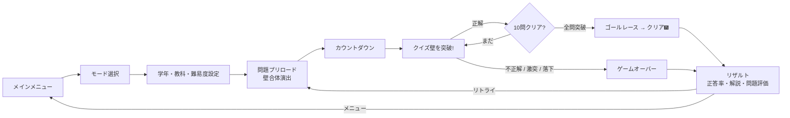
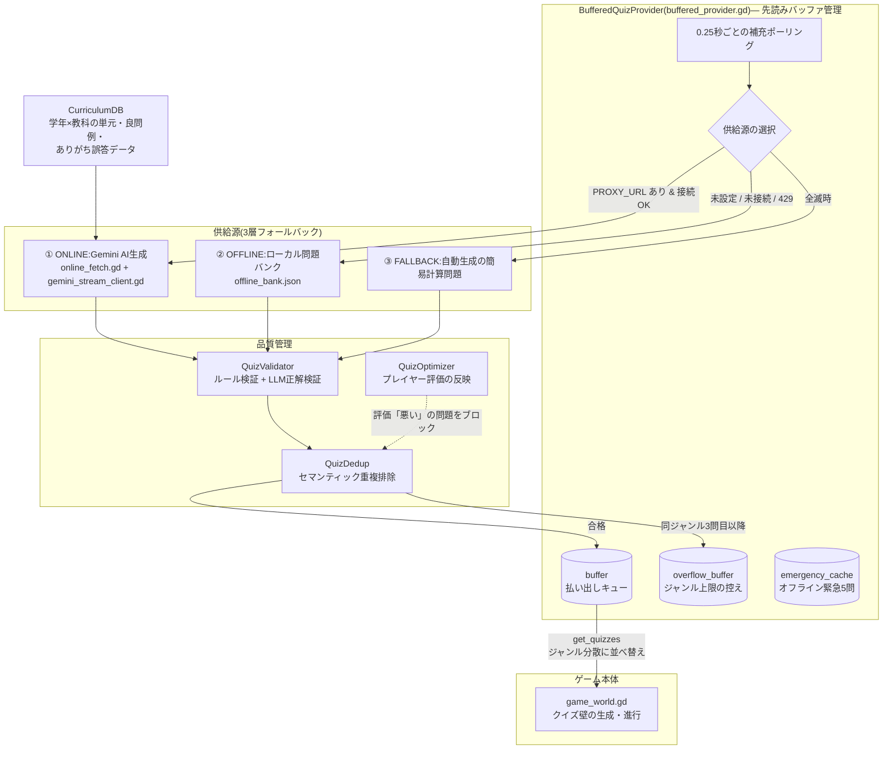
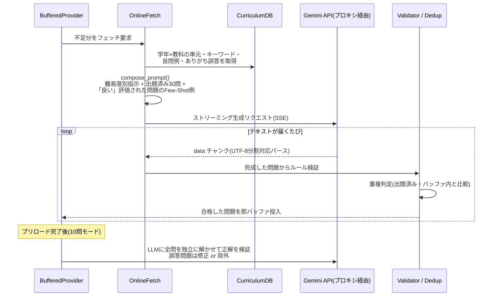
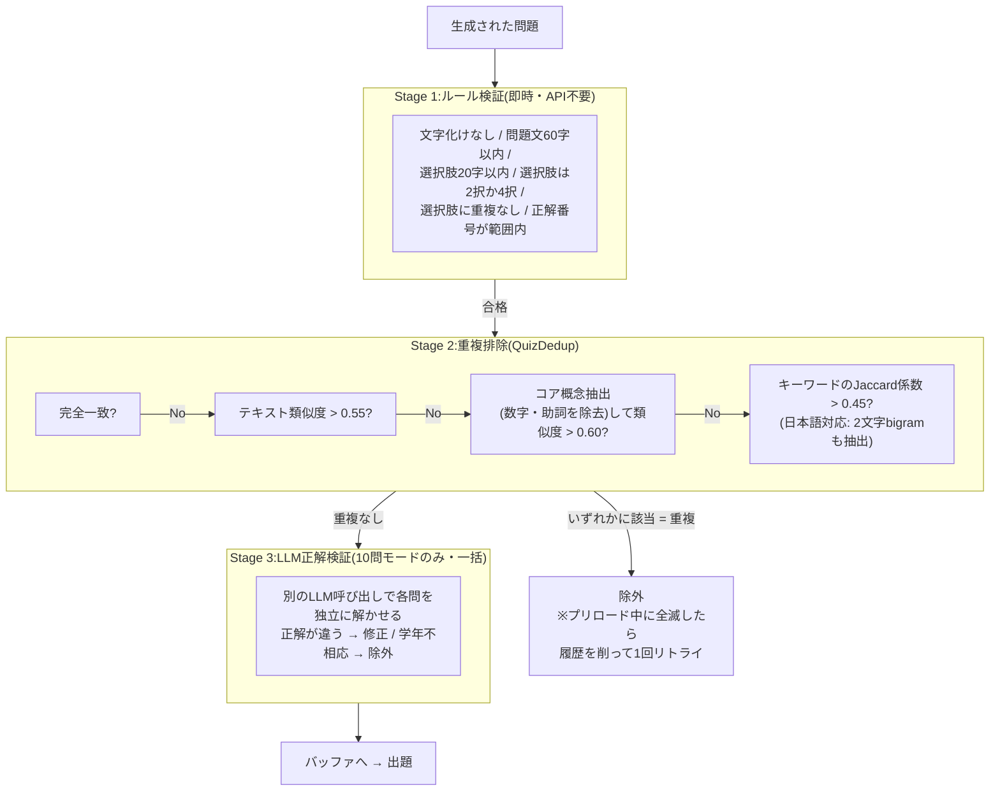
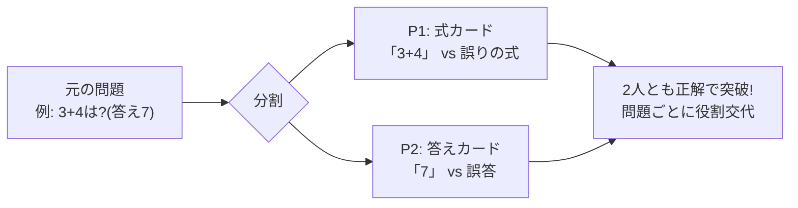

# AIQUIZ 3D

**AIがリアルタイムに問題を生成する、3Dクイズアクションゲーム**(Godot 4.6 / Forward Plus)

迫りくる「クイズ壁」に開いた正解のドアをくぐり抜けて進む、走って学べる小学生向けクイズゲームです。問題は Gemini API によってプレイのたびに新しく生成されるため、同じ問題の繰り返しになりません。

*このファイルはプレビューで開いてください*

---

## 目次

- [ゲームの内容](#ゲームの内容)
- [遊び方](#遊び方)
- [操作方法](#操作方法)
- [ゲームモードと設定](#ゲームモードと設定)
- [カスタマイズ要素](#カスタマイズ要素)
- [問題生成の仕組み](#問題生成の仕組み)
- [動作環境と起動方法](#動作環境と起動方法)
- [プロジェクト構成](#プロジェクト構成)

---

## ゲームの内容

ブロックマン(キャラクター)を操作して、次々と迫ってくる**クイズ壁**を突破していくゲームです。

- 各壁には問題文と、選択肢が書かれた**ドア**が並んでいます
- **正解のドア**をくぐると壁が砕け散り、次の問題へ進めます
- **不正解のドア**に突っ込む、壁に激突する、または足場から落下すると即ゲームオーバー
- 10問モードでは全問突破後にゴールラインを駆け抜けてクリア

演出面の特徴:

- **PSX(初代プレイステーション)風レンダリング** — 頂点スナップ・アフィンテクスチャの意図的なローポリ表現
- **アクティブラグドール** — HFF(Human: Fall Flat)風の体幹物理。ゲームオーバー時は脱力して崩れ落ちます
- 壁合体の火花、ドア破砕の物理チャンク、クリア時の花火など、パーティクル演出多数

## 遊び方

1. **メインメニュー**でモードを選ぶ(10問 / エンドレス / チュートリアル、1人 / 2人)
2. **学年(1〜6年)・教科(算数 / 理科 / 国語 / 社会 / ALL)・難易度(Easy / Normal / Hard)** を設定
3. スタートすると問題のプリロード(先読み生成)が始まり、壁が左右から飛んできて合体する演出の後、カウントダウン壁が表示されます
4. 任意のキーを押すとゲーム開始。壁が迫ってくるので、問題文を読んで正解のドアへ移動してくぐり抜けます
5. 難易度が高いほど壁の接近速度が上がります
6. クリア / ゲームオーバー後はリザルト画面で正答率・連続正解数・所要時間・各問題の解説を確認できます。問題の「良い / 悪い」評価を送ると、以降のAI生成の品質改善に反映されます

## 操作方法

### 1人プレイ

| 操作 | キー |
|---|---|
| 移動 | `W` `A` `S` `D`(矢印キーも可) |
| ジャンプ | `Space` |
| エモート(ダンス) | `1` `2` `3`(スロット1〜3) |
| カメラ | プレイヤー後方から固定追従 |
| ポーズ / 再開 | `Esc` |
| リスタート(リザルト後) | `R` |

### 2人プレイ(ローカル)

| 操作 | プレイヤー1 | プレイヤー2 |
|---|---|---|
| 移動 | `W` `A` `S` `D` | `↑` `↓` `←` `→` |
| ジャンプ | `Space` | `Ctrl` |
| エモート | `1` `2` `3` | `8` `9` `0`(Num7/8/9も可) |

2人プレイでは各プレイヤーの正解数が個別にカウントされます。**協力モード問題**では、1人が「式・根拠カード」、もう1人が「答えカード」を分担して選ぶ問題が出題されます(問題ごとに役割が交代)。

## ゲームモードと設定

| モード | 内容 |
|---|---|
| **10問モード** | AI生成の10問を突破してゴールを目指すメインモード |
| **エンドレスモード** | 問題が無限に出題され続ける。どこまで進めるか挑戦 |
| **チュートリアル V2** | 1Pは基本操作チェック、3つのクイズ壁、海・サメの危険演出を練習し、最後にカスタマイズ紹介へ進む。2Pは個別採点と最終GOAL競争のあと、同じカスタマイズ紹介を挟む |

設定画面ではさらに以下を調整できます:

- BGM / SFX 音量スライダー
- 解像度(720p / 1080p / 1440p / 4K / フルスクリーン)
- API状態チェック(インターネット・AIゲートウェイ・Firebase の疎通確認)

## カスタマイズ要素

メインメニューの「カスタマイズ」から設定できます(3Dプレビュー付き)。

- **帽子** — P1・P2 それぞれに好きな帽子を装備。ゲーム中キャラの頭に表示されます
- **エモート** — Mixamo 製のダンスモーションを3つのスロットに割り当て。ゲーム中にキー1発で約1秒間ダンスします

---

## 問題生成の仕組み

このゲームの核心は、**プレイ中にバックグラウンドで問題をAI生成し続けるパイプライン**です。供給源は3層のフォールバック構造になっており、ネットワークやAPIの状態が悪くてもゲームが止まりません。

### 全体アーキテクチャ

### AI生成の流れ(ONLINE時)

問題はプロキシサーバー経由で **Gemini API** に依頼します(APIキーはクライアントに置きません)。

- 10問モード: `gemini-3.5-flash`(高品質)、並列2リクエスト・1秒間隔
- エンドレスモード: `gemini-3.1-flash-lite`(軽量・高速) ※現在はONLINEモードでのエンドレスモードは不安定なので閉鎖中
- 解説の補充・正解の一括検証: `gemini-3.5-flash`

プロンプトには次の情報が組み込まれます:

| 要素 | 内容 |
|---|---|
| 基本条件 | 学年・教科・難易度・問題数、文字数制限(問題50字 / 選択肢15字 / 解説50〜100字) |
| カリキュラム | 単元(ランダム3つ)、重要概念、学年別の良問例、生徒がよくやる間違い |
| 禁止事項 | 下学年の内容、3桁以上の筆算(算数)、正解が曖昧な問題 |
| 自己チェック | 全問が異なる単元・重複なし・正解位置ランダムであることをAI自身に確認させる |
| 出題履歴 | 直近30問の概念リスト(同テーマの再生成を防止) |
| 難易度 | temperature を Easy 0.6 → Normal 0.8 → Hard 0.95 と変化 |

### 検証と重複排除

生成された問題は2段階で検証されます。

比較対象は「今のバッファ・このラウンドの出題済み・過去ラウンドの履歴(最大300件、`user://recent_quiz_history.json` に永続化)・低評価の問題」まで含むため、**ラウンドをまたいでも同じ問題が出にくく**なっています。

### 先読みバッファとジャンル分散

- 10問モードはラウンド開始時に10問をプリロード。1ラウンド内の**同一ジャンルは最大2問**(超過分はoverflowに控え)、払い出し時も連続同ジャンルを避けて並べ替え
- エンドレスモードは進行に応じてバッファ目標を 3問 → 4問 → 6問 と動的拡張し、遊びながら裏で補充し続けます
- オンラインが遅延した場合、エンドレスでは1.5秒待ってからオフライン問題で一時的に穴埋め

### オフライン時のフォールバック

| 状況 | 動作 |
|---|---|
| `PROXY_URL` 未設定 | OFFLINEモードに強制(ローカル問題バンク) |
| インターネット未接続 | OFFLINEに自動切り替え |
| APIレート制限(429) | 一定時間待機して再試行 |
| ローカルバンクも枯渇 | 足し算の簡易問題を自動生成(FALLBACK) |

### 協力モード問題の分割

2人プレイでは、1つの問題を**2人分の2択カード**に分割します(coop_quiz_builder.gd)。

教科ごとにカードの種類が変わります: 算数=式/答え、国語=言葉/読み、理科=条件/現象、社会=手がかり/答え。

---

## 動作環境と起動方法

- **エンジン**: Godot 4.6(Forward Plus)
- **起動**: Godot エディタで `project.godot` を開き、実行(メインシーンは `ui/main_menu.tscn`)
- **AI生成を使う場合**: 環境変数 `PROXY_URL` に Gemini プロキシサーバーのURLを設定(未設定時はデフォルトのプロキシ、それも使えない場合はオフラインモードで動作)

## プロジェクト構成

| パス | 内容 |
|---|---|
| `scripts/autoload/` | シングルトン(GameManager, QuizManager, AudioManager, NetworkManager など) |
| `scripts/core/` | 問題生成パイプライン(provider / fetch / validator / dedup / curriculum ほか) |
| `scripts/world/` | 3Dゲームプレイ(game_world, quiz_wall, player_controller, ラグドール) |
| `scripts/ui/` | メニュー・HUD・カスタマイズ画面 |
| `scripts/cosmetics/` | 帽子・エモートのデータとファクトリ |
| `assets/curriculum/` | 教科×学年のカリキュラムJSON(単元・良問例・ありがち誤答) |
| `addons/psx/` | PSX風レンダリングアドオン |
| `ui/` | シーンファイル(.tscn) |
| `tools/`, `tests/` | 重複排除・バッファ等の単体テスト |
