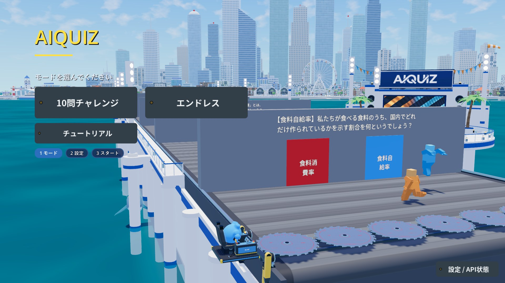
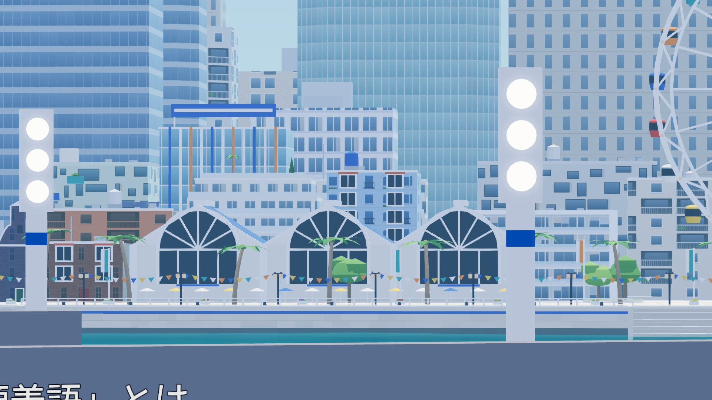

# AIQUIZ HARBOR LAUNCH（メインメニュー専用ステージ）— 制作資料

> **2026-10-01：発進デッキ（海の上の人工島。LED ディスプレイ・AIQUIZ の看板・スピーカー・ヤシ）はメニューに組み立てなくなった**
> （`AiquizMenuStage.BUILD_LAUNCH_DECK = false`。街・岸辺・観覧車と、カメラの俯角 -7° はそのまま）。LED 番組「AIQUIZ VISION」は
> ゴール側の電光掲示板に移った（[docs/menu_led.md](../../docs/menu_led.md)）。`aiquiz_menu_stage.glb`・Blender の制作資料・島の組み立てのコードは、
> 戻せるように残してある（`BUILD_LAUNCH_DECK` を `true` にすると島が戻り、その LED にも従来どおり番組が流れる。`_attach_led_program` はそのまま）。
> 以下の節はデッキを含む 2026-09-30 までの記録。

メインメニューの背景を、ゲームプレイ画面の奥に見える街（スタジアムの遠景 `AQS_BG_City`）のそばの「港の発進ステージ」にした。
メニューのデモ（AI の 2 人がコンベアを走り、壁・のこぎり・保守船・ヘリの回収）はそのまま動き、そのまわりを飾る。

- 走路（ゲームのコンベア）は **飾らない**（2026-09-30）：以前の白い桟橋の飾り（ベルトの箱の側面の白い外装とコバルトの帯、白い丸杭、奥の歩道・ガラスの手すり・琥珀の灯・照明塔）は取り除いた。
  外装だけはビルダーの `KEEP_PIER_FASCIA`（`source/blender/ams_common.py`）を `True` にすると戻る（下の節）
- 走路の右の海に **発進デッキ**（ディスプレイのステージ）：丸い床（舗装・リングパッド・琥珀の灯・一周のガラスの手すり・杭と筋交い）、背景の壁（スピーカー塔・LED・AIQUIZ の看板）、デッキの照明塔・吹き流し・ヤシ・旗。
  走路への橋は 2026-09-30 に取り除いた
- **街を目の前に**：スタジアムの遠景の街を、メニューのカメラから方位 25°・1.1km に置き直す（高層ビルは画面の上で切れる距離＝「ビル群のそば」）
- **カメラ**：俯角を -14° から -7° に浅くして街を画面に入れる。保守船の入港の間は従来の俯角へ寄せて船を映す
- **ビル群の手前（岸辺の街）**：スタジアムの遠景の街は遠目用で、高層ビルの手前が窓のない箱・平らな護岸・丸い木の列だけだった。
  メニューでは 750〜950m と近く粗さが目立つので、その帯を取り除いて港町に作り直した（`source/blender/ams_waterfront.py`、下の節）。
  観覧車は 2026-09-30 に **回る観覧車** に作り直した（下の節）

## 2026-09-30 の変更（走路の脇を片付け、観覧車を回す）

ユーザーの依頼：「コンベアの横の白い杭と横についているライトを消して、コンベアとディスプレイの間の道も消して、ディスプレイが立っているステージだけ残して。
奥の観覧車もちゃんと動く観覧車に作り直して」。

**状態：2026-09-30 にライブの Blender（5.1.2、Higgsfield の Blender 連携）で作り直し、検算 26 項目すべて合格**（三角形 ステージ 11,006、街 95,000）。
新しいファイルから組み立てると、スタジアムから読み込む街の `AQS_NightGlow` が先に作った同名の材質とぶつかって `AQS_NightGlow.001` になり
（検算「街の材質が遠景の材質」で落ちる）、Godot の名前での差し替えが効かない。`.001` の使い手を元の材質に付け替えて消し、もう一度ビルダーを実行した
（街は保持して使い回すので、2 回目からは名前がそろう）。作り直す前の GLB・配置 JSON・`.blend` は作業用の控えに退避した。
確認：Blender のレンダー（`artifacts/aiquiz_menu_stage/blender/review_cam_menu.png`・`review_cam_runway.png`・観覧車の `review_ferris_0.png` と 20° 回した `review_ferris_20.png`）、
Godot の `menu_harbor_stage` 48 項目・`menu_led` 全項目合格、ゲームの画面 `artifacts/aiquiz_menu_stage/game/`（`ferris_wheel_a`・`ferris_wheel_b` で輪が回っている）。

- 走路の脇：`AMS_Piles`（白い丸杭）・`AMS_RunwayEdge`（奥の歩道・ガラスの手すり・琥珀の灯）・`AMS_LightTowers`（照明塔）を組み立てない。
  `ams_parts.py` の関数（`piles`・`edge_walk`・`edge_lamps`・`edge_towers`）は戻すときの参考に残す（使っていない）
- 発進デッキから走路への橋：床・手すり・橋の下の杭と、手すりと灯の「橋の口」を取り除いた（手すりは一周、琥珀の灯は 18 すべて）。配置 JSON の `launch_deck.bridge_z` もなくなる
- ベルトの箱の側面の白い外装（`AMS_PierFascia`）：組み立てない。**戻すとき**は `ams_common.py` の `KEEP_PIER_FASCIA = True` にして作り直す（配置 JSON の `stage_meshes` に入り、テストもそれに合わせる）
- 検算とテストに「走路の脇（|x| < 16、ベルトの z の範囲）には外装のほかに何もない」を足した
- 観覧車（`ams_waterfront.ferris_wheel`、位置・直径 60m・ゴンドラ 24・色はそのまま）を 3 種類の部品に分けた：
  - `AMS_FerrisWheelStand`（動かない、街のローカル）：前後 2 組の A 字の脚（基礎・横つなぎ）、軸受けと軸、前後の脚をつなぐ低い梁、乗り場（白い台とコバルトの帯・前の階段 2 段・前半分の屋根と柱）
  - `AMS_FerrisWheelRim`（回る、**原点＝軸の中心**）：前後 2 本の輪（外の輪・内の輪と V 字の格子のトラス、y ±2.0）、スポーク 48（ハブの両端から、半分は交差）、ハブとコバルトのフランジ、
    前の橙と白の羽根の飾り（遠目にも回るのが分かる）、ゴンドラの吊り棒 24、夜の灯（外の輪 48・内の輪 24、`AQS_NightGlow`）
  - `AMS_FerrisGondola_00`〜`_23`（**原点＝吊り点**＝吊り棒の中心）：吊り具・色の腰・ガラスの帯・色の帯・屋根
  - 回る部分とゴンドラは y で住み分ける（ゴンドラ |y| ≤ 1.02 は 2 本の輪のあいだ、脚と軸受けは |y| ≥ 4.6、乗り場の屋根は輪の前の灯より前）。いちばん下のゴンドラの床は乗り場の床の 0.3m 上を通る
  - 切符売り場（`plaza`）を右の脚の足もとから離した（`WHEEL_X + 16` → `+ 21`）
  - 三角形（ビルダーの形の計算だけで数えた値）：脚と乗り場 370・輪 3,840・ゴンドラ 84×24＝2,016、計 6,226（前は 5,632）。ステージは 24,780 → 11,006
- 配置 JSON の `city.waterfront` に `wheel_axle_local`（軸の中心）・`wheel_axis_local`（軸の向き、+y＝輪の正面・カメラの側）・`wheel_hang_radius`（吊り点の半径 30）・`wheel_gondolas`・`wheel_nodes` を足した。
  `wheel_center_local` と同じ Blender の街のローカル（x, y, z）で、Godot の街のローカルでは (x, z, -y)
- Godot（`AiquizMenuStage`）：街を作った後に `AMS_FerrisWheelRim` と `AMS_FerrisGondola_*` を探し、`_process` で輪を軸まわりに回し（`FERRIS_WHEEL_PERIOD` = 180 秒で 1 周、
  正でメニューのカメラから見て時計回り、0 で止まる）、ゴンドラは原点（吊り点）を輪と同じだけ回して向きは変えない（`GONDOLA_SWAY_DEG` = 1.2° のゆっくりした揺れだけ）。
  計算は街のローカルで、毎フレームの確保なし。LED 番組のコードには触れていない
- ビルダーの確認レンダーに `cam_ferriswheel.png`（止まった姿勢）と `cam_ferriswheel_turned.png`（20° 回した姿勢）を足した



## ビル群の手前（岸辺の街、2026-09-29 追加）



- 意匠：Codex CLI の描き足し。本物の街を写した下絵に、A「フェリーターミナル・時計塔・灯台・マリーナ・パステルの街並み」と
  B「観覧車・アーチ窓の市場・階段の護岸・日よけ・旗」を塗ってもらい、両方の要素を合わせた（`source/concepts/r5_*`、`r6_*`）
- 元の街（`AQS_BG_City`）の複製から、手前の低い箱 104 棟（とその屋上の設備）・護岸・砂浜・並木を面の島ごとに取り除く（`AMS_City`）。
  高層・中層ビルはそのまま
- 作り直した帯（街のローカル、岸は y 252、地面は z 4.5）：
  - `AMS_CityQuay`：石積みの護岸（濡れた帯・コバルトの帯・白い笠石）、水へ下りる階段 6 か所、白い手すり、係船柱、防舷材、
    浮き桟橋 6 本と指桟橋、曲がった防波堤と赤白の灯台（メニューの画面の左端に入る）
  - `AMS_CityPromenade`：歩道の舗装、灯（夜に光る）、ヤシ、並木、縦の旗、観覧車の前の小旗、観覧車の広場と切符売り場
  - `AMS_CityWaterfront`：3 列の建物（下の「建物の型」）、通りの木、アーチ窓 3 連の市場ホール、波の屋根と時計塔のフェリーターミナル
  - 観覧車：直径 60m（ゴンドラ 24、外周の灯は夜に光る）。メニューの画面の中央（走路の壁の上、看板の左）。
    2026-09-30 から `AMS_FerrisWheelStand`（脚と乗り場）・`AMS_FerrisWheelRim`（回る輪）・`AMS_FerrisGondola_00`〜`_23` に分かれ、Godot で回る（上の節）
  - `AMS_CityBoats`：マリーナのモーターボートとヨット、ターミナルのフェリー
- 材質：頂点色は `AQS_BG_Painted`、夜の灯は `AQS_NightGlow`（スタジアムと共有）。外壁は `AMS_Facade_*` の 10 種
  （`source/textures/make_textures.py` の `harbor_facade_*`、夜の窓明かりつき）。
  Godot では遠景のシェーダー（距離のかすみ・夜の窓明かり）に差し替える（`AiquizMenuStage._facade_material`）
- 遠くで重なる面は壁から 0.2m 以上離す（750m 先では数 cm の差は奥行きの精度で揺れる）。舗装は土地の上面から 0.25m 上

### 建物の型（2026-09-29、「窓の格子がそろいすぎ」への対応）

Web で実在のアパート・マンションの外観を調べ（資料の一覧は `source/PROMPTS.md`）、Codex に型の見本帳
（`source/concepts/r7_building_catalogue.png`）と実画面の描き替え（`r7_street_variety.png`）を作ってもらい、12 の型で作り分けた。
建物ごとに外壁の画像の 1 スパン・1 階の長さを変える（`Skin`）ので、隣り合う建物の窓の高さと間隔がそろわない。隣に同じ型を置かない。

| 型（`ams_waterfront.BUILDERS`） | 列 | 形 | 外壁の画像 |
| --- | --- | --- | --- |
| `med` 地中海の家 | 1 | 日よけ・看板板・カフェのパラソル、瓦の寄棟か屋上テラス | `shop`：アーチの店先、鎧戸・花箱、窓のない列とアーチ窓の列 |
| `canal` 運河の家の並び | 1・2 | 間口 5.5〜8.5m、階段・首・鐘・三角の破風と白い笠石、滑車の梁、色の扉、奥の切妻 | `brick`：長手積み、白い枠の縦長の窓、アーチ窓の列 |
| `bay` 出窓の建物 | 1〜3 | 縦に積んだ出窓（白い枠・ガラス・色の屋根） | `brick` か `shop` |
| `mansion_h` 横ラインのマンション | 2・3 | 各階のバルコニー（手すり：ガラス・すりガラス・腰壁・格子・腰壁＋ガラス）、両端の額縁の柱と梁、隔て板、入口の庇 | `mansion`：引き違いのガラス戸とカーテン |
| `mansion_v` 縦ラインのタイル張り | 2・3 | 画像の柱の列にそろえた縦の柱、石の基壇と店のガラス、頂部の帯 | `tile`：二丁掛けタイル、縦長の窓の列、凹んだバルコニー |
| `apato` アパート | 2 | 2〜3 階、外廊下（床・手すり・柱）、折り返しの鉄骨の外階段、前へ出る屋根 | `corridor`：玄関扉・格子の小窓・メーター・玄関灯 |
| `loggia` ロッジア | 2・3 | 基壇、屋上庭園 | `loggia`：凹んだバルコニーの市松 |
| `punched` 不規則な窓 | 2・3 | 薄い笠木、半分は色の箱のバルコニーを散らす | `punched`：大きさも位置もばらばらの窓 |
| `ribbon` 横連窓 | 2・3 | 前の角を丸める（帯が角を回る）、張り出す屋根 | `ribbon` |
| `terrace` 段々テラス | 2・3 | 上の階ほど後退、各段の手すりと植栽 | `flat`・`punched`・`loggia` |
| `hotel` 色のフィンのホテル | 3 | 縦のフィン（ぼかし・差し色・紺）、ロビーと庇、屋上の看板の枠（文字なし） | `glass` か `flat` |
| `flat` 集合住宅 | 2・3 | バルコニーの帯、最上階の後退 | `flat`：掃き出し窓（列ごとに幅を変える） |

- 元の街の中層ビル（高さ 105m 未満・間口 50m 未満）の 65% も、外壁を住宅の型の画像に貼り替える（`build_menu_stage.restyle_midrise`、60m を超える棟は落ち着いた型だけ）。
  高層の象徴のビルは事務所のガラスのまま
- 2026-09-29 の組み立て：建物 145 棟（地中海の家 24・運河の家の並び 17・出窓 16・ロッジア 16・横ライン 16・縦ライン 13・不規則な窓 13・段々 9・ホテル 8・アパート 6・横連窓 5・集合住宅 2）、
  中層の貼り替え 44 棟

## ユーザー決定（2026-09-29）

- 画像生成は Higgsfield ではなく Codex CLI（ChatGPT Pro）で行う
- デザイン：コンセプト A「港の発進デッキ」（`source/concepts/r1_A_harbor_launch_deck.png`）
- 背景のデモ：**コンベアのデモを新ステージで続ける**（壁・のこぎり・保守船・ヘリの回収・カスタマイズの壁速度タブはそのまま）

## ゲームでの使われ方

| 場所 | 中身 |
| --- | --- |
| `scripts/world/menu_stage/aiquiz_menu_stage.gd`（`AiquizMenuStage`） | GLB を原点に置き、材質を名前で差し替え、街（`aiquiz_menu_city.glb`）を配置 JSON の位置と向きに置く（遠景の共有材質と、岸辺の外壁は遠景のシェーダー）。カメラの回転も JSON から。観覧車を回す（`_process`、1 周 180 秒、ゴンドラは向きを変えない） |
| `scripts/ui/menu_wall_background_preview.gd` | `_build_3d_scene` でステージを作る（`StageEnvironment` の後）。`menu_camera_rotation_degrees()`、保守船の入港中は従来の俯角へ寄せる |
| `scripts/ui/menu_preview_camera_settings.gd` | 既定のカメラ回転を `menu_camera_rotation_degrees()` から |
| `shaders/aiquiz_menu_led.gdshader` | LED：LED 番組「AIQUIZ VISION」（ハイライト映像と戦績、`scripts/ui/menu_led/`、[docs/menu_led.md](../../docs/menu_led.md)）の SubViewport とそのミップを映す。番組が読めないときは橙と水色の斜めの帯が流れ、11 秒ごとに看板の画像（AIQUIZ のロゴ）を走査線で映す。LED の粒 216×98 |
| `shaders/aiquiz_menu_sway.gdshader` | 旗・吹き流し（速く小さく）とヤシの葉（ゆっくり）を UV2.x の重みで揺らす |
| `shaders/aiquiz_menu_lamp.gdshader` | 灯（昼も光る）。琥珀の灯は位置ごとにずらして明滅、スポットライトのレンズは明滅しない |

材質：`AQS_Painted`（スタジアムと共有の頂点色）、`AMS_Lamp`、`AMS_Glass`、`AMS_LedScreen`、`AMS_Sign`、`AMS_Paving`（舗装の画像×頂点色）、`AMS_Pennant`、`AMS_Foliage`。

**元に戻すとき**：`project.godot` に `aiquiz/menu/harbor_stage=false`（`[aiquiz]` の `menu/harbor_stage`）を足すと、従来の背景（コンベアだけ・俯角 -14°）に戻る。

## 他の演出との約束（何も置かない所）

`aiquiz_menu_stage_layout.json` の `keep_clear` とビルダーの検算・テストが守る。

- ベルトの箱（|x| < 12、z -136〜8）とその上：何も置かない（外装を戻したときは箱の側面の外 x 12.0〜12.32）
- 走路の脇（|x| < 16、z -136〜8）：2026-09-30 から何も置かない（外装を戻したときの外装だけ）
- のこぎりの台車が動く手前（z > -12）：操縦席のデッキが左へ 2.25m 張り出し、収納した刃が |x| 14.0〜16.7・ベルト面の 1.9m 下に吊られる。
  外装を戻したときも、上端は操縦席のデッキの下（y ≤ -2.3、デッキの下面から 0.3m 以上）
- ヘリの回収点（x -8〜4、z -4、高さ 10.2m、ローター半径 5）と、回収後のブースト（-Z へ 78m/s、高さ 13〜22m）：x -14〜10・高さ 5.8m 以上に何も置かない。
  発進デッキは x 18〜42

## 書き出したもの（Godot が読み込む）

| ファイル | 中身 |
| --- | --- |
| `aiquiz_menu_stage.glb` | メニューのワールド座標の部品 8 個（`AMS_LaunchDeck`・`AMS_Backdrop`・`AMS_LedScreen`・`AMS_Sign`・`AMS_DeckTowers`・`AMS_Palms`・`AMS_PalmLeaves`・`AMS_Pennants`。`KEEP_PIER_FASCIA` のとき `AMS_PierFascia` も）。三角形 約 11,000、材質 8（作り直し後に `build_report.json` で確かめる。2026-09-29 の版は走路の脇の部品を含む 12 個・24,780） |
| `aiquiz_menu_city.glb` | メニューの街（街のローカル座標）：`AMS_City`（元の街から手前の帯を除き、中層の一部の外壁を住宅の型に貼り替えたもの）・`AMS_CityQuay`・`AMS_CityPromenade`・`AMS_CityWaterfront`・`AMS_FerrisWheelStand`・`AMS_FerrisWheelRim`（原点＝軸）・`AMS_FerrisGondola_00`〜`_23`（原点＝吊り点）・`AMS_CityBoats`。材質 17、建物 145 棟（12 の型）・ボート 49 隻。三角形は 2026-09-29 の版で 94,406（元の街 5,312、観覧車 5,632）、作り直すと観覧車が 6,226 になる |
| `aiquiz_menu_stage_layout.json` | カメラ、街の置き方（位置・向き、岸辺の観覧車の軸・軸の向き・吊り点の半径・ゴンドラの数）、ステージの部品の一覧（`stage_meshes`）、発進デッキ（中心・向き・パッド）、看板と LED の中心と大きさ、デッキの照明塔の頂、何も置かない所（走路の脇を含む）、材質の扱い |
| `aiquiz_menu_stage_*.png`・`aiquiz_menu_city_*.png` | Godot が GLB から取り出したテクスチャ（看板・LED の予備・舗装、街と岸辺の外壁と夜の窓明かり） |

## 制作資料（`source/`、Godot の読み込み対象外）

| パス | 内容 |
| --- | --- |
| `blender/build_menu_stage.py` | **ビルダー**（部品・参照・街の手前の作り直し・カメラ・書き出し・検算・レンダー・`.blend` の複製保存）。部品は `ams_parts.py`、岸辺の街は `ams_waterfront.py`、共通の値は `ams_common.py`（ゲームの .gd から定数を直接読む）。形と材質の道具はスタジアムの `aqs_geom.py` を使う |
| `blender/SCENE_PASSPORT.md` | 組み立ての仕様と結果 |
| `blender/aiquiz_menu_stage.blend` | 組み立て結果（シーン `AIQUIZ_MenuStage`：部品・ベルトと壁とキャラの仮置き・保守船・メニューの街（元の `AQS_BG_City` は隠して残す）・カメラ 9 台） |
| `build_report.json` | 検算（三角形・材質・ベルト・のこぎり・ヘリの通り道・走路の脇・デッキの位置・看板と LED の向き・面の向き、街：三角形・手前の帯を除いたか・材質・カメラからの距離、観覧車：部品が分かれているか・原点・吊り棒・1 周回したときに輪・脚・乗り場・ゴンドラどうしが当たらないか） |
| `textures/make_textures.py` | 看板（`icon.jpg` のロゴをそのまま白で）、LED の予備、舗装（1.5m のタイル、目地）、岸辺の外壁 `harbor_facade_*` 10 種（建物の型ごと：shop・flat・glass・mansion・tile・corridor・loggia・brick・ribbon・punched、夜の窓明かり） |
| `concepts/`・`prompts_src/`・`PROMPTS.md`・`generation_record.json` | Codex CLI で作ったコンセプト・下絵・配置案・描き足しと、そのプロンプトと採否 |
| `tools/codex_image.sh` | Codex CLI で画像を 1 枚作る手順（プロンプトは標準入力、保存先はセッション id で拾う） |
| `previews/ingame/`・`previews/blender/` | ゲームの実画面と Blender の確認レンダー |

## 作り直し

```powershell
python assets/aiquiz_menu_stage/source/textures/make_textures.py
```

Blender のビルダーは、ユーザーが開いているライブの Blender 上で動かす（Higgsfield の Blender 連携 `bl_execute`）。
`get_host_status` で接続を確かめ、未接続なら接続を依頼して待つ。`--background` のヘッドレス実行で代替しない。
ビルダーはシーン `AIQUIZ_MenuStage` だけを作り直し、他のシーンには触れない。

```python
import runpy, sys
for n in [m for m in list(sys.modules) if m.startswith(("ams_", "aqs_geom"))]:
    del sys.modules[n]
sys.argv = ["blender", "--"]           # レンダーを省くなら ["blender", "--", "--no-render"]
runpy.run_path(r"C:/AIQUIZ/AIQUIZ-Godot/assets/aiquiz_menu_stage/source/blender/build_menu_stage.py", run_name="__main__")
```

約 8 秒（レンダーなしは約 1 秒）で GLB 2 つ・JSON・`.blend`・確認レンダー（`artifacts/aiquiz_menu_stage/blender/`、岸辺の望遠 `cam_waterfront*.png`、
観覧車の望遠 `cam_ferriswheel.png`・`cam_ferriswheel_turned.png` を含む）・`build_report.json` を作り直す（2026-09-30 の版は観覧車の検算とレンダー 2 枚のぶん少し延びる）。
最後の行 `AMS_BUILD {"all_checks_pass": true, ...}` が合格の印（検算 26 項目：ステージ 13・街 6・観覧車 7）。
Godot への取り込みは `./Godot_v4.7.2-stable_win64_console.exe --headless --path . --import` で確実に行う（2026-09-29、エディターの再インポート操作では `.godot/imported` の `.scn` が更新されず、古い形のまま確認していたことがあった。`.godot/imported/aiquiz_menu_stage.glb-*.scn`・`aiquiz_menu_city.glb-*.scn` の更新時刻で確かめる）。

## 確認

```powershell
./Godot_v4.7.2-stable_win64_console.exe --path . --script res://tests/menu_harbor_stage_bootstrap.gd
./Godot_v4.7.2-stable_win64_console.exe --path . --script res://tests/helicopter_crossing_bootstrap.gd -- --players=2 --fps=60 --label=harbor_p2
```

- `menu_harbor_stage`（画面付き、48 項目。2026-09-30 の版）：ステージと街ができる、ステージの部品 8 つ（走路の脇の杭・歩道・照明塔がない、外装は `stage_meshes` のとおり）、
  材質の差し替え、街の位置と向き、カメラの回転、街と看板が画面に入る、
  岸辺の街の部品（観覧車の脚と輪を含む 7 つ）、岸辺の外壁が遠景のシェーダー、観覧車が走路の壁の上・看板の左に見える、
  **観覧車が回る**（輪とゴンドラ 24 が街のノード、輪の原点が軸、1 秒で輪が軸まわりに設定の速さ・向き（カメラから見て時計回り）で回る、
  ゴンドラの原点が輪の吊り点と同じだけ動き、吊り点の円の上にあり、向きは揺れの 1.2° 以内）、
  ベルト・のこぎりの収納・ヘリの通り道・走路の脇に何もない、カスタマイズ（壁速度・スキン・エモート）から戻るとカメラが港の俯角に戻る。
  岸辺はメニューのカメラの位置からの望遠（`waterfront_zoom`・`waterfront_left`）、観覧車は 3 秒あけて 2 枚（`ferris_wheel_a`・`ferris_wheel_b`）も撮る
  （照明塔の寄り `tower_head`・`tower_oblique` はやめた）。
  画面は `artifacts/aiquiz_menu_stage/game/`（主なものは `source/previews/ingame/`）
- `helicopter_crossing`（1 人・2 人、実際のスタートの流れ）：どちらも全項目合格（回収・ブースト・ワイプ・ステージへの到着）

2026-09-29 に Forward+（RTX 5070）で確認。2026-09-30 の作り直しの後、`menu_harbor_stage` 48 項目、`helicopter_crossing` 1 人 22 項目・2 人 39 項目がすべて合格。
