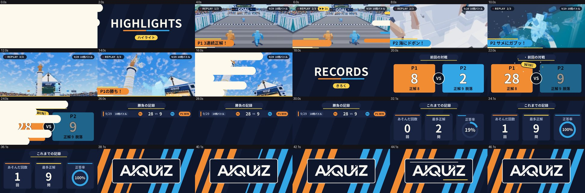

# LED 番組「AIQUIZ VISION」（ゴール側の電光掲示板）

2P の 10 問バトルのリザルトで、**勝者のカットイン（「1P WIN!」）のあと**、ゴールの先の電光掲示板（`GS_ScoreboardScreen`、`GoalStandScoreboard`）に、
いま終わった試合の結果と、これまでの戦績を流す（ハイライトのリプレイ映像は流さない）。2026-10-01 まではメインメニューの港のステージ（`assets/aiquiz_menu_stage`）の LED 画面 `AMS_LedScreen` に流していた。
そのステージ（発進デッキ＝人工島）はメニューに組み立てなくなった（`AiquizMenuStage.BUILD_LAUNCH_DECK`、街・観覧車は残っている）。
アニメーション（レイアウト・動き・色・切り替え）は After Effects で作り、Godot は AE のレイヤーを 1 対 1 で再生して、言葉・数字・映像だけを差し込む（スコアタワー・フィナーレの HUD と同じ作り方）。

## ゴール掲示板での再生

リザルト演出（フィナーレ）は 6.9 秒で判定「WIN」、11.2 秒でボタン待ち（`STATE_CLEAR`、そのまま無期限に待つ）になる。掲示板は次の順に変わる。

| 時間 | 掲示板 |
| --- | --- |
| 試合中 | これまでどおり勝敗表（`GoalStandScoreboard` の 1〜10 問の○） |
| 6.9 秒〜 | 勝者のカットイン（「1P WIN!」・選手の人形・引き分けは「DRAW!」）を保持する |
| 11.2 秒〜（試合の保存が終わってから） | 番組の**つなぎ**：番組のワイプ（`WIPE_Strokes`）の覆う半分が、カットインの上を左から覆う（0.45 秒）。覆い切った瞬間に番組へ入れ替わる |
| その後 | `RECORDS` → 前回の対戦 → 履歴 → 通算 → ロゴ（下の「番組の流れ」の 3〜7）。**ハイライトのリプレイ（1・2）は掲示板では流さない**（`GoalStandScoreboard.PLAY_REPLAY = false`：番組にクリップを渡さない）。シーンを離れる（もう一度・メニュー）まで続く |

- 試合の記録とハイライトは `STATE_CLEAR` に入ってから保存される（`MatchReel._commit`）。保存が終わるのを待つので、**今の試合**が「前回の対戦」と履歴の先頭に出る。
  `MatchReel.is_ready()` が真になると切り替わる。保存が終わらなくても `GoalStand.PROGRAMME_WAIT_MAX`（6 秒）で切り替える（`MatchReel` が無いとき＝テストのハーネスは待たない）
- 起動条件は `state.result_presentation_active`（ローカルのフィナーレ）だけ。オンライン・チュートリアル・リプレイの `CLEAR` は今までどおりカットインのまま
- 掲示板は 1400×600、番組は 1296×588。横に 8％伸ばして全面に貼る。LED の粒（448×192）にするのも、遠くのちらつきを抑える 7 段のミップも、掲示板側（`goal_stand_scoreboard_led.gdshader`）が受け持つので、番組側のミップは作らない（`MenuLedProgram.setup(null, null, 0)`）
- 掲示板から遠いとき（`ACTIVE_DISTANCE` 170 m より外）は、番組と掲示板の描き直しを止める（`MenuLedProgram.set_active(false)`）
- 一度番組に入ったらカットインには戻らない（判定は出たままなので、戻さないよう `GoalStandScoreboard` が抑えている）
- 見える大きさ：フィナーレのカメラからだと、LED 面は 1080p で 450×200 px ほど（画面の幅の 1/4。観客の前の看板などに少し隠れ、斜めに見える）。タイトル・ロゴ・スコアの大きい数字は読めるが、履歴や通算の小さい文字は読み取りにくい

- **ハイライト**：試合中の見せ場を、ゲームのカメラから小さな連番 JPEG で自動保存する（`MatchReel` / `HighlightCapture`）
- **戦績**：試合が終わるたびに 1 件ずつ記録する（`MatchHistory`）。以前は保存の仕組みが無かった（`highscores.json` の書き込みは 4 月に削除済み、リプレイ録画は封印中）
- 記録がまだ無い間は、「まだ記録がないよ」の案内とロゴを流す



## 番組の流れ

| 順 | 場面（AE コンポジション） | 長さ | 中身 |
| --- | --- | --- | --- |
| 1 | `LED_Sting` | 2.4 秒 | 見出し「HIGHLIGHTS／ハイライト」。橙と水色の太い線が左右から交差して抜け、文字が弾んで出て、下線が中央から伸びる |
| 2 | リプレイ | 可変（1 見せ場 4〜6 秒） | 1 試合の**すべての見せ場**を試合の順に。下の「リプレイ」 |
| 3 | `LED_Sting` | 2.4 秒 | 見出し「RECORDS／きろく」 |
| 4 | `LED_Versus` / `LED_Solo` | 5.6 / 5.2 秒 | 前回の試合。2 人：左右からスピード線とともにパネルが入り、得点をカウントアップ（フィナーレと同じ 0.5 刻み）、確定で数字が跳ね、3 秒で勝者の角に「WIN!」と金の線が飛び散り、負けた側は少し暗くなる（引き分けは中央に「DRAW」）。1 人：正解数・最大連続・プレイ時間 |
| 5 | `LED_History` ×1〜2 | 6.6 秒 | **勝負の記録**：新しい順に 4 件ずつ（2 ページまで）。日付・モード・P1 と P2 の得点・結果（P1 WIN／P2 WIN／DRAW、1 人は CLEAR／PERFECT／GAME OVER）。行ごとに金の線が走って右から入る |
| 6 | `LED_Stats` | 6.0 秒 | これまでの記録：あそんだ回数・最多正解・正答率（リングが割合まで伸びる） |
| 7 | `LED_Logo` → `LED_LogoLoop` | 3.2 秒＋**3 分** | AIQUIZ のロゴ。`LED_LogoLoop`（8 秒で継ぎ目なくつながる：縞が流れ、8 秒ごとにロゴの上下を線が走る）を `LOGO_HOLD_SECONDS`（180 秒）続けてから次のラウンドへ |

次のラウンドは 1 つ前の試合をリプレイする（ハイライトが残っている試合を新しい順に巡る）。

**場面の切り替え**（`WIPE_Strokes`、1.0 秒）は、Putti Monkey Wrench「トランジションについて学ぼう -シェイプアニメーション編-【AfterEffects/チュートリアル】」のシェイプのトランジションを参考にした。
丸い線端の太い線（6 行、行ごとに少しずつずらす）が左から伸びてクリーム色で画面を覆い（0〜0.45 秒）、後端が右へ抜けて次の場面が現れ、そのすぐ後ろを金・橙・水色の同じ形の線が追いかける。
場面そのものは切り替えを持たず、Godot がつなぎ目ごとに重ねる（覆う半分を前の場面の終わりに、開く半分を次の場面の始めに）。ロゴとそのループのあいだだけは重ねない。

## リプレイ

- 画面いっぱいに映像。**上の帯はやめ**、左上に「● REPLAY 2/5」、早送り中はその横に「▶▶ 2x」、右上に日付とモードの小さな札、下端に進み具合の金の線だけを置く
- 見せ場のあいだは **2 倍の早送り**（全体が 70 秒を超えるときは 3 倍）、各見せ場の 1.2 秒前から 1 秒後までは等速、見せ場の瞬間（0.12 秒前〜0.5 秒後）は **0.5 倍のスロー**。最後のコマで 0.35 秒止めてから次へ
- 見せ場の名前（例「P1 3連続正解！」「P2 サメにガブッ！」）は、その瞬間の 0.35 秒前に左下から選手の色の帯（`REPLAY_Caption`）で入り、2.8 秒で右へ抜ける。1 本のクリップに見せ場が 2 つあれば（海に落ちてサメにかまれる、など）それぞれに出る
- 見せ場から次の見せ場へは、細い線が横切りクリーム色が一瞬光るカット（`CUT_Strokes`）で切り替える
- クリップのコマは読み込むときに 320×180 に縮め、再生中の見せ場と次の 2 本だけを持つ。コマの間は重ねて滑らかにし、見せ場ごとにゆっくり寄る

## ハイライトの録画（`scripts/world/match_reel/`）

`GameWorld` が試合ごとに `MatchReel` を作る（リプレイ・チュートリアル・テストのハーネスでは作らない。テストは保存先を差し替えたときだけ記録する）。

- `HighlightCapture`：試合の World3D を共有する小さな SubViewport（432×243）が、いまのカメラ（フィナーレの演出カメラも含む）を毎秒 12 枚（画質：高・最高 15、標準 12、低 8、モバイルは録画しない）描き直す。HUD は写らない。
  GPU からの読み戻しは `RenderingDevice.texture_get_data_async` で非同期に行い、ゲームは待たない（Compatibility では小さい画像の直接読み出し）。直前 2.5 秒をリングバッファに持つ。
  実測（標準画質）：1 枚 CPU 0.34 ms・GPU 0.33 ms、毎秒 8 ms ほど
- 見せ場を `mark()` すると、バッファの数秒前から数秒後までが 1 本のクリップになる。録画中のクリップに重なる見せ場はそのクリップに加わり（最長 8 秒まで延ばす）、**それぞれの見せ場の秒を残す**。同じ種類が 2 人同時なら 1 つ（プレイヤー 0）にまとめる。JPEG（品質 0.75）はワーカースレッドで作る
- 2 人プレイで片方が海に落ちると、メインのカメラは走り続ける方を映したままで、落ちた様子は右下の死亡ワイプ（`DeathWipe` の `WipeCamera`）が映す。落ちてからサメにかまれた 1.8 秒後までは、**録画もワイプのカメラから撮る**（`HighlightCapture.follow`）
- 見せ場と優先度：

| 種類 | 条件 | 前／後（秒） | 優先度 |
| --- | --- | --- | --- |
| `win` / `draw` | フィナーレの判定（EFFECT、6.9 秒） | 1.4 / 2.6 | 90 / 86 |
| `perfect` / `clear` | 1P の 10 問で全問正解／クリア | 2.2 / 1.4 | 88 / 70 |
| `goal` | オンライン等のゴール競争の勝者 | 2.2 / 1.4 | 76 |
| `ghost_hit` | 脱落した側がゴーストシャークの体当たりを当てた | 2.6 / 1.8 | 72 |
| `near_miss` | のこぎりまで 0.45 m 以内に迫られてから 2 m 以上逃げた | 2.2 / 0.6 | 62 |
| `shark` | 海でサメにかまれた | 1.2 / 1.8 | 60 |
| `ocean` | 海に落ちた（サメが来るまで録り続ける） | 1.5 / 3.0 | 58 |
| `saw` | のこぎりにつかまった | 1.8 / 1.4 | 55 |
| `streak` | 連続正解が 3・5・7・10（2P は人ごと） | 2.0 / 1.0 | 40 + 4×連続数 |
| `push` | 押し合いの体当たり | 1.2 / 1.2 | 38 |
| `out` | 壁やスクロールで脱落 | 2.0 / 1.2 | 30 |

- 試合が終わると（CLEAR、またはリザルト保留中でない GAME_OVER）、録画中のクリップの完成を待ち、**その試合のクリップすべて**（多いときは優先度の高い 16 本まで）を試合の順に、戦績とともにワーカースレッドで書き出す。途中でポーズメニューからやめた試合は記録しない
- 2P の正解数・挑戦数・連続は `question_winner_decided` と `QuizGameState.get_question_evaluated_mask()`（その壁で判定された人）から数える。1P はゲームの `score` / `total_answered` / `max_streak`

## 保存先（`user://`）

| パス | 中身 |
| --- | --- |
| `match_history.json` | `MatchHistory`。最大 200 試合：モード・人数・教科・学年・終わり方・時間、人ごとの正解・挑戦・最大連続・HP・生存、フィナーレの得点（0.5 刻みを 2 倍した整数）、勝者、ハイライトの id |
| `highlights/index.json`・`highlights/<id>/000.jpg…` | `HighlightStore`。直近 3 試合ぶん（最大 48 本）。古い試合のクリップはフォルダごと消す。1 本 30〜90 枚・0.3〜1 MB。各クリップに試合内の順番・秒と、中の見せ場すべて（種類・プレイヤー・秒） |

書き込みは一時ファイル経由（途中で落ちても壊れない）。番組は読む前に `MatchReel.wait_for_write()` で直前の試合の書き込みを待つ（掲示板は `MatchReel.is_ready()` を確かめてから始めるので、待たされない）。

## Godot での再生（`scripts/ui/menu_led/`）

- `AeMotion`：`led_motion.json` のコンポジションを Control の木にする汎用プレイヤー。AE のレイヤー空間をそのまま使い（位置＝AE の位置−アンカー、回転・拡大の中心＝アンカー）、長方形・楕円・**直線のパス**（塗り・線・丸い／平らな線端・トリムパスの始点と終点）、文字、画像、ヌル、親子、プリコンポ（開始時刻のずれと枠での切り抜き）、イン・アウト点を扱う。ヌルの不透明度はタイミング用の値（`progress`）として読む。`override_base` で共有のデータを変えずにその場だけ位置などを変える
- `MenuLedProgram`：ラウンドの組み立て、つなぎ目のトランジション、リプレイの計画（`plan_replay`：早送り・等速・スローの区間と見せ場の名前の出る秒）、場面ごとの差し込み（文字・選手の色・丸枠の幅を文字に合わせる・勝者バッジの位置・負けた側の暗さ・リングの割合・カウントアップ・勝負の記録の行）、クリップの JPEG をワーカースレッドで読み込み。
  `begin_lead_in()`（カットインの上に覆う半分だけを透明な背景で描く）、`set_active()`（止める・再開）、`setup(records, clips, mip_levels)` の段数の指定がゴール掲示板用
- 1296×588 の SubViewport に描く。`GoalStandScoreboard`（`_start_programme`）が `get_texture()` を掲示板の SubViewport に貼る。
  半分ずつ縮めたミップ（既定 4 段）を作ると `shaders/aiquiz_menu_led.gdshader`（メニューの LED 用の 216×98 の粒。いまは使っていない）に渡せる
- `led_motion.json` が読めないとき（`setup()` が偽）は、掲示板はカットインのまま（`Programme.FAILED`）

## After Effects の制作データ（`assets/aiquiz_menu_stage/source/ae/`、Godot の読み込み対象外）

| ファイル | 中身 |
| --- | --- |
| `AIQUIZ_MenuLED.aep` | After Effects 2026。フォルダ `AIQUIZ_MenuLED` に上の場面と `BG_Ambient`・`WIPE_Strokes`・`CUT_Strokes`・`REPLAY_Frame`・`REPLAY_Caption`・`CLIP_Media`（仮の映像）・縞のプリコンポ、確認用に `REPLAY_Demo` と全体をつないだ `LED_ProgramPreview` |
| `build_led.jsx` | コンポジションの構築（作り直すと手作業の調整は消える）。動きの約束：太い線はトリムパスで伸びて抜ける（速く出て柔らかく止まる）、エコーは同じ曲線で少し遅れて追う、入場は「少し下から 95→100%、0.21 秒遅れて不透明に」、主役だけ跳ねる、パネルだけ小さく行き過ぎて戻る。Godot はモーションブラーを描かないので AE でも切っている |
| `sample_led.jsx` | `assets/aiquiz_menu_stage/led/led_motion.json` の書き出し（レイアウト・色・文字・パスの端点と線端と、動くプロパティ・トリムの 60fps サンプル） |
| `render_review.py`（`render_frames.jsx`・`contact_sheet.py`） | 指定の秒をフレームに書き出してコンタクトシートにする（`previews/`）。例：`python render_review.py previews/wipe_sheet.jpg 5 WIPE_Strokes=0.2,0.45,0.7` |
| `make_led_media.py` | `led/led_logo.png`（看板と同じロゴを白・透過で）と仮の映像 `media/clip_placeholder.jpg` |
| `ae_run.mjs` | Higgsfield のローカル AE ブリッジ経由で .jsx を実行 |

AE で位置やキーを調整したら `sample_led.jsx` だけ実行すれば Godot に反映される。

```powershell
python assets/aiquiz_menu_stage/source/ae/make_led_media.py
node assets/aiquiz_menu_stage/source/ae/ae_run.mjs assets/aiquiz_menu_stage/source/ae/build_led.jsx
node assets/aiquiz_menu_stage/source/ae/ae_run.mjs assets/aiquiz_menu_stage/source/ae/sample_led.jsx
```

## 検証

```powershell
# 実際の 2P 試合（3 連続正解、P2 が海に落ちてサメにかまれる、フィナーレで P1 勝利）を録画・保存して確かめる
# （保存先は user://test_match_reel）
./Godot_v4.7.2-stable_win64_console.exe --path . --script res://tests/match_reel_bootstrap.gd
# LED 番組：単体の確認（リプレイの速さの区間など）、ラウンドの順番とロゴの 3 分、リプレイの各拍、
# つなぎ目で画面が覆われること、場面ごとの撮影、掲示板への載せ替え（カットインの上のストローク、番組だけの板）、記録なしの番組
./Godot_v4.7.2-stable_win64_console.exe --path . --script res://tests/menu_led_bootstrap.gd
# 上の試合で録画したデータで。record で 1 ラウンドを連番に（round/、round_board/。ロゴの 3 分は 6 秒で打ち切る）
./Godot_v4.7.2-stable_win64_console.exe --path . --script res://tests/menu_led_bootstrap.gd -- data=reel record
C:/ffmpeg/bin/ffmpeg -framerate 30 -i artifacts/menu_led/menu/round_board/%04d.png -c:v libx264 -pix_fmt yuv420p artifacts/menu_led/led_programme_round.mp4
# 掲示板の切り替えの条件（ユニット、ヘッドレス）：カットインのあと・試合の保存が終わってから・フィナーレだけ・戻らない・タイムアウト
./Godot_v4.7.2-stable_win64_console.exe --headless --path . --script res://tests/goal_stand_bootstrap.gd
# 実際のフィナーレ（1080p）：カットイン → ワイプ → RECORDS → 前回の対戦 … ロゴまで（リプレイは流さない）。
# 実画面と掲示板の画像を out の下の p1_programme/ に、切り替えのフレーム時間をログ（PROGRAMME_OBSERVED）に出す
./Godot_v4.7.2-stable_win64_console.exe --path . --script res://tests/result_ceremony_bootstrap.gd -- runtime case=p1 quality=high reel programme out=programme
```

結果は `artifacts/menu_led/`（`match_reel/`：レポートとクリップのコンタクトシート、`menu/`：レポートと撮影）と `artifacts/result_finale/runtime/<out>/`（フィナーレの撮影）。
