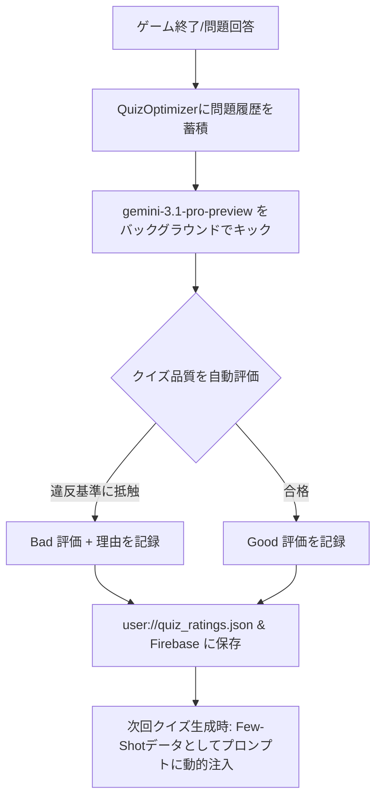

# AIQUIZ 3D ゲーム詳細仕様書 (Unity移植用)

本書は、Godot 4.4 3Dで開発された『AIQUIZ 3D』をUnity環境へ移植し、同様の仕様で完全再現するための詳細仕様書です。Unity向けAI開発エージェントが、ゲームデザイン、物理定数、ビジュアル演出、およびオンラインAIクイズ生成の仕組みを深く理解し、破綻なく実装できるように整理されています。

---

## 1. ゲーム概要 & コアサイクル
『AIQUIZ 3D』は、迫り来る「クイズの壁」に対し、正しい解答の「ドア」を通り抜けるトレッドミル型（ランナー系）の知育3Dアクションゲームです。

### 基本ゲームサイクル
1. **問題ロード・構築演出**: 
   ラウンド開始前にAIまたはローカルデータベースからクイズがロードされ、3D世界に「クイズの壁」が順次構築（左右からスライドイン合体）されます。
2. **カウントダウン**: 
   スタートバリア（巨大な壁）が上から落下してプレイヤーの進路を塞ぎ、3秒のカウントダウンが表示されます。
3. **ゲームスタート**: 
   カウントダウン終了と同時にスタートバリアが爆発四散し、床が動き始めます。
4. **ラン＆回答**: 
   プレイヤーはコンベアのように手前（-Z方向）に流れる床の上を左右に走り、ジャンプしながら正解のドアに向かいます。
5. **判定と進行**:
   * **正解**: ドアをすり抜ける（実際はドアが4x5個の細かいブロックに爆散する）と、スピードを落とさずに走り続け、次の問題へ進みます。
   * **不正解・衝突・落下**: 不正解ドアに入ったり、壁部分に激突したり、床の左右からマグマへ落下するとゲームオーバーです。プレイヤーはバラバラに爆散し、マグマに落ちたパーツは縮小して沈んでいきます。
6. **クリア**: 
   規定問数（通常10問）を突破すると、ゴールゲートが現れ、そこを通過するとクリアになります。

---

## 2. 座標系・物理定数 & 操作仕様 (Physics & Controls)

Godotプロジェクトで定義されている物理パラメータおよび座標設定を以下に示します。Unityに移植する際は、これらのスケール感および定数を再現してください。

### 2.1 空間・オブジェクト定数
* **床の上面高さ (Y座標)**: `Y = -1.2` (床の厚みは別)
* **床の全幅**: `24.0` (中心から左右に `±12.0`)
* **奈落・マグマ判定高さ (Y座標)**: `Y < -8.0` 付近で落下死亡（マグマ表面はおおよそ `Y = -9.2`、落下限界を `Y = -8.0` 付近にクランプして、キャラクターの爆発エフェクトがマグマに完全に沈みきらない位置で再生されるようにします）
* **プレイヤー移動可能範囲 (X座標)**: `X = -6.5` 〜 `6.5` (1Pでの安全範囲。これを超えるとレールの外に落ちる可能性があります)
* **壁の配置初期位置 (Z座標)**: `Z = 22.0` (最初の壁)
* **壁の間隔 (Z軸の間隔)**: `30.0`
* **ドア衝突判定位置 (Z座標)**: `Z = -6.0` (プレイヤーのZ位置が壁のZ位置に対して `壁.z - 0.4` に達したときに衝突判定)
* **床のスクロールアウト限界 (Z軸の後方限界)**: `Z = -12.5` (この値より後ろに流れた壁は粉砕処分されます)

### 2.2 物理定数
* **重力 (Gravity)**: `18.0` (Unityの物理または自作の落下ロジックで適用)
* **ジャンプ力 (Jump Force)**: `7.0` (垂直上方向の初速度)
* **プレイヤーの左右移動速度 (Player Speed)**: `7.6`
* **壁の流れる速度 (Wall Speed)**: AI予測解答時間（後述）から動的に算出。
  * **最小速度**: `1.0`
  * **最大速度**: `8.0`
  * **デフォルト/手動速度**: `3.5`（デバッグ用）

### 2.3 操作仕様 (1P & 2P)
* **Player 1 (左側 / 1P)**
  * 移動: `A` / `D` または `左矢印` / `右矢印`
  * ジャンプ: `Space`
  * エモート: `1` / `2` / `3`
* **Player 2 (右側 / 2Pローカル)**
  * 移動: `テンキー4` / `テンキー6` または `左矢印` / `右矢印` (2P対戦モード時)
  * ジャンプ: `Right Ctrl` または `テンキー0`
  * エモート: `8` / `9` / `0`

---

## 3. ゲームモード (Game Modes)

### 3.1 10問チャレンジ (TEN_QUESTIONS)
* プレイヤー1人（または2人）で全10問のクイズに答えるメインモード。
* 10問正解（全員死亡せずに突破）後、Z座標にゴールゲート (`goal_z = wall_start_z + 10 * wall_spacing + 15.0`) が出現。
* プレイヤーがゴールラインを越えるとクリア演出（花火）が発生。
* **2P対戦モード**: 10問チャレンジを2人で同時にプレイし、スコアまたはゴール到着順で競います。片方が死亡してももう片方が生きていればゲームは継続します。両方が死んだ場合はゲームオーバーです。

### 3.2 エンドレスモード (ENDLESS)
* ライフが尽きる（マグマに落ちる、壁に激突する）まで、制限なくクイズが出題され続けるモード。
* 3問ずつバックグラウンドでクイズをバッファ補充し、出題ごとに順次前方へ壁を並べます。
* 5問正解ごとに、壁のスクロール速度が微加速し、緊張感が向上します（最大+20%）。

### 3.3 2人協力モード (COOP)
* **2人協力専用クイズ**: 
  1つの問題に対して、P1側とP2側でそれぞれ異なるドアが配置されます。
  * **P1の役割**: 「式」または「前提条件/根拠」カードの選択（例: `3 + 4`, `「時計」の読み` など）
  * **P2の役割**: 「答え」カードの選択（例: `7`, `とけい` など）
* **車線分割 (Lane Split)**:
  コンベア床の中央にギャップ（通り抜け不能な隙間）があり、P1は右レーン (`X >= 2.55`)、P2は左レーン (`X <= -2.55`) に強制的に分けられます。
* **ドア位置**:
  * P1ドア: `X = [4.1, 8.1]` (右側レーン、2択)
  * P2ドア: `X = [-8.1, -4.1]` (左側レーン、2択)
  * ドアの幅: `1.15` (通常より狭い)
* **ドッキング判定**: 
  両プレイヤーが同時に自分の正解カードのドアに接触する必要があります。片方でも間違えるか、壁に衝突するか、落下すると即座にゲームオーバーとなります。

### 3.4 3Dチュートリアル (TUTORIAL)
* 操作方法（左右移動、ジャンプ、エモート）とルールを実際に体験するモード。
* チュートリアル用の固定クイズ（3問）が出題されます。
* 落下したりドアを間違えても即ゲームオーバーにはならず、解説メッセージを表示してその場でスタート位置に戻り、同じ壁でリトライさせます。

---

## 4. ビジュアル・グラフィック演出 & 特殊シェーダー

レトロな質感と高品質な動的演出を組み合わせた、プレミアム感のあるビジュアルを目指します。

### 4.1 レトロ3Dグラフィック (PSXシェーダー)
ゲーム全体に初代PlayStation（PS1）風のレトログラフィックを再現するポストエフェクト/カスタムシェーダーを適用します。
* **アフィン・テクスチャマッピング (Affine Texture Mapping)**: 3Dポリゴンのパースペクティブ補正を意図的に弱め、カメラが動いたときにテクスチャがぐにゃぐにゃと歪む効果を再現。
* **ジッター効果 (Vertex Jitter)**: 頂点座標の精度（ビット深度）を粗くし、頂点がピクセル単位でパタパタと小刻みに揺れる効果。
* **カラー減色 (Color Bit Depth)**: 16bitカラーなどの荒い色階調（カラーパレット制限）。
* **フォグ (Fog)**: レトロ感を演出する濃い距離フォグ（デフォルトフォグカラー: `Color(0.82, 0.85, 0.90)`、開始距離 `10.0` 〜 終了距離 `20.0`）。

### 4.2 コンベア床 (Conveyor Belt Floor)
動くコンベアベルトのビジュアルを再現。
* 床のテクスチャをZ座標に沿ってスクロールさせます。
* 左右にダークグレーのガイドレール (`FLOOR_RAIL_WIDTH: 0.16`, `FLOOR_RAIL_HEIGHT: 0.26`)。
* 床の前後端に円柱状のローラー (`CONVEYOR_ROLLER_RADIUS: 0.48`) を配置。ローラーの表面も床スクロールと同調して回転。
* 床の裏側にリターンベルトを配置し、完全なループ構造として見せています。

### 4.3 マグマ液体シェーダー (Magma Fluid Shader)
床の左右に広がるマグマの海。非常に高品質な3Dシェーダーで描画します。
* **波の変位 (Vertex Wave)**: 複数のサイン波とノイズテクスチャを組み合わせて、マグマの表面を緩やかにうねらせます。ホットスポットには泡立ちの変位を追加。
* **ボロノイき裂 (Voronoi Cracks)**: 時間で流動するボロノイノイズを使用し、マグマの表面が固まった「冷たい地殻（ダークレッド）」と、その隙間から覗く「白熱する溶岩の裂け目（オレンジ〜黄色）」を表現。
* **4色グラデーション**: 温度（熱パラメータ）に基づいて、`深部暗赤色 -> 中間赤色 -> 高温オレンジ -> 白熱黄色` へとブレンド。
* **発光 (Emission Bloom)**: 溶岩の裂け目は強く自発光し、Bloom（カメラのグロー効果）で幻想的に光り輝きます。

### 4.4 3D壁のプレロード・ドッキング演出 (Slide-in Merge)
クイズがロードされるたびに、ステージの遥か遠方で壁が組み立てられる演出です。
1. **シルエットの出現**: 
   クイズが到着すると、壁の初期位置（Z軸）の左右 (`X = ±150.0`) から、半透明ブルーの軽量ボックスシルエット (`BARRIER_SIZE: 8.0 x 5.5 x 0.4`) がスライドインします。
2. **超高速合体**: 
   シルエットはEaseOutExpo（急ブレーキがかかるイージング）で中央に向かって飛び、中心で合体（マージ）します。
3. **合体エフェクト**: 
   合体した瞬間に、壁のスケールが一時的に `1.15` 倍に弾け、中央から激しい火花パーティクル（Sparks）と閃光（Flash）が飛び散り、画面が激しく揺れます（カメラシェイク）。その後、壁のスケールが `1.0` に戻り、完成したクイズの壁が出現します。

### 4.5 スタートバリア (Start Barrier)
ゲーム開始時、プレイヤーの目の前 (`Z = wall_start_z - 7.0`) に立ち塞がる巨大な鋼鉄の壁です。
* **落下**: プレロードが完了すると、上空からズドンと落下し、着地時に足元から激しい埃（ダストパーティクル）が吹き出し、画面が強く揺れます。
* **カウントダウン**: カウントダウン中、壁の中央に大きな数字 (3, 2, 1) が浮かび上がり、壁全体がカウントダウンの進行に伴って激しくガタガタと振動します。また、壁の左右から高圧の「蒸気（スチームパーティクル）」が勢いよく噴き出します。
* **大爆発**: `GO` のタイミングでスタートバリアが大爆発を起こします。壁が数十個のRigidBody3D破片となって左右・上・前方へ吹き飛び、超巨大な爆発エフェクト（閃光、火花、黒煙）が発生します。

### 4.6 クイズの壁とドアの仕様
* **壁の形状**: 
  上梁（Top Beam）、下梁（Bottom Beam）、およびドアをくり抜いたような複数の柱（Pillars）の組み合わせで構成されています。
* **ドアの色**:
  * 2択: 左 = 青 (`Color(0.10, 0.60, 0.95)`), 右 = 赤 (`Color(0.90, 0.15, 0.10)`)
  * 4択: A = 青, B = 緑 (`Color(0.15, 0.75, 0.30)`), C = オレンジ (`Color(0.95, 0.60, 0.10)`), D = 赤
* **ドアの文字表示 (Label3D)**:
  選択肢テキストをドアの表面に表示。日本語フォント（NotoSansJPなど）を読み込んで使用。
  * **分数フォーマッタ**: 分数を含む解答の場合、インライン分数表示（`1/2`）や、スタック型分数（縦書きの分数 `1` の下に横線、その下に `2`）に動的整形してきれいに描画します。
* **正解ドアの物理崩壊**:
  プレイヤーが正解ドアを通過する瞬間、元のドアコライダーを非表示にし、代わりにドアと同サイズの4x5のグリッド状の破片（RigidBody3D）を生成。
  * 破片に前方（+Z方向）および上方向へのインパルスを適用して弾け飛ばします。
  * 破片はプレイヤーと衝突せず、床コライダーのみと衝突します。
  * 生成後 `1.5` 秒待ってから、Tweenでスケールを `0` に向けて縮小させ、自動的にクリーンアップ (`Destroy`) します。
* **壁全体の爆散 (奈落落とし)**:
  プレイヤーが壁を通過し、壁が崖の後方限界 (`FLOOR_BACK_Z`) に達した際、壁全体が自動的に崩壊します。
  * 梁や柱、残ったドアなどのパーツが、1.5m単位の細かいRigidBody3D破片に粉砕され、奈落方向（-Z軸方向）および上・左右へ大きく爆散しながら、同様に縮小消滅します。
* **BOSS問題の演出**:
  10問チャレンジの最終問題などでは壁がボス化します。
  * 壁の色が暗赤色に変化し、上部に「BOSS問題」という禍々しい3Dラベルが出現。
  * 壁の左右端から常時激しい火花パーティクルが吹き出し続けます。

---

## 5. プレイヤー表現 & アニメーション (Player Rigging & Procedural Animation)

プレイヤーキャラクターはレトロな「ブロック人間」です。

### 5.1 キャラクター構造 (26個のジョイント構成)
キャラクターはジョイント（関節）を軸とした木構造で構築されています。
* **Root**: Pelvis（骨盤。ベース座標）
  * **Lower Torso** (下半身ブロック)
  * **Spine** (背骨ジョイント) -> **Upper Torso** (胸ブロック)
    * **Neck** (首ジョイント) -> **Head Pivot** -> **Head** (頭ブロック) & **Hat Mount** (帽子装着点)
    * **Left Shoulder** (左肩) -> Left Upper Arm -> **Left Elbow** -> Left Lower Arm -> **Left Wrist** -> **Left Hand**
      * **手の指の階層**: Thumb (Metacarpal/Proximal), Index, Middle, Ring, Pinky (それぞれ Proximal/Intermediate/Distal)
    * **Right Shoulder** (右肩) -> ... (左と同様)
  * **Left Hip** (左股関節) -> Left Thigh -> **Left Knee** -> Left Calf -> **Left Ankle** -> Left Foot -> **Left Toe** -> Left Toe Mesh
  * **Right Hip** (右股関節) -> ... (左と同様)

### 5.2 アニメーションの制御
ゲームは2つのアニメーションモードをサポートしています。
1. **プロシージャルアニメーション（手動波形生成）**:
   Mixamoなどの3Dモデルが読み込めない、またはオフライン時のフォールバック。
   * **走行時**: `sin(phase)` や `cos(phase)` の波形に基づき、骨盤の上下揺れ（ボビング）、背骨のひねり、肩・股関節の逆相スイング、膝の折り曲げ、つま先の蹴り出しなどをスクリプト制御で計算。
   * **ジャンプ時**: 上昇時は手足を縮めつつつま先を下に向け、下降時は着地に備えて足首を曲げるポーズ。
   * **落下時（もがき）**: マグマに落ちた際、サイン波で手足をバタバタと激しく振り回し、背骨をのけ反らせ、骨盤をきりもみ回転させながら落下します。
2. **FBXリグモード (Mixamo同期)**:
   UnityのAnimatorまたはSkeletonボーン構造を使用。
   * FBXアニメーション（走る、ジャンプ、エモートなど）の各フレームのボーン姿勢（ローカル/グローバルマトリクス）を読み取り、ブロック人間の対応する各ジョイントにリアルタイムで転写します。
   * 1P/2Pの操作やエモート、移動状態に合わせて適切にポーズをブレンド・適用します。

### 5.3 死亡時のバラバラ爆散 (Drowning & Exploding)
プレイヤーが障害物に激突するか、マグマに落ちて死亡した際、凄惨かつコミカルなバラバラ爆散が発生します。
1. **もがき (0.0s 〜 2.0s)**: 
   死亡トリガー後2秒間は、マグマの中、あるいは空中で手足をジタバタと悶絶させながら物理運動します。
2. **パーツ分離 (2.0s 〜)**:
   全身の関節結合を切り離し、頭、胴体、腕、足、さらには被っていた帽子のパーツまですべてを独立した物理オブジェクト（重力の影響を受ける破片）に変換します。
3. **吹き飛び**:
   各パーツに対し、左右に分かれる方向のランダムな初期速度 (`X = ±(2.0〜6.0)`, `Y = 4.0〜9.0`, `Z = ±3.0`) と回転角速度を適用し、放物線を描いて爆散させます。
4. **マグマへの沈下**:
   パーツがマグマの表面（`Y = -9.2`）より下に落ちた場合、落下速度を1/20に減衰させて「ゆっくり沈む」挙動にしつつ、時間経過とともに破片のスケールを `0` に向けて縮小（熱による溶解を表現）させ、完全に消滅したらオブジェクトを破棄します。

### 5.4 帽子のカスタマイズ & ボブルヘッド物理 (Bobblehead Physics)
プレイヤーはロビー等で「帽子」を選択して装着できます。
* **ボブルヘッド（赤ベコ）物理**:
  特定の帽子（例：首がバネで揺れるマスコット帽子など）を被っている場合、帽子のマウントポイントに簡易的な「バネ・ダンパー物理シミュレーション」を適用します。
  * キャラクターの移動加速度、ジャンプ時の慣性、頭の回転、さらには走る振動などを入力力 (Force) としてバネ運動方程式を計算。
  * `加速度 -> 角度の変位 -> バネの復元力 (Spring K) -> 減衰力 (Damping)` の計算式により、帽子がリアルかつコミカルに「プルプル」と揺れ動く慣性運動を表現します。

---

## 6. クイズデータベースとAI生成システム (Quiz System & Generative AI)

本ゲームの最大の特徴は、Gemini API等のLLMを利用したリアルタイムのクイズ動的生成と、AIによる自己最適化（自己学習）ループです。

### 6.1 教科書カリキュラムデータベース (CurriculumDB)
オフラインでのクイズ出題およびAI生成プロンプトの構成用として、学年・教科別のカリキュラム定義ファイルを保持しています。
* **ファイル配置**: `res://assets/curriculum/<教科>/grade_<N>.json` (理科・社会の1〜2年は生活科として `grade_1.json` に統合)
* **JSON構造**:
  ```json
  {
    "keywords": "重要キーワード",
    "bad_examples": ["簡単すぎる/不適切な問題例のテキスト"],
    "units": [
      {
        "name": "単元名",
        "key_concepts": ["重要概念・公式定義"],
        "typical_mistakes": ["生徒がよくやる間違い（誤答選択肢のヒント）"],
        "sample_questions": [
          {
            "q": "問題文",
            "c": ["選択肢1", "選択肢2", "選択肢3", "選択肢4"],
            "a": 0,
            "e": "解説文"
          }
        ]
      }
    ]
  }
  ```

### 6.2 オンラインAIクイズ生成プロンプトの構成
LLMに送信するプロンプトは、以下の情報を動的に連結して構成します。

1. **システム指示 (System Instruction)**:
   ```text
   あなたは日本の小学校で20年以上の指導経験を持つベテラン教員です。
   文部科学省の学習指導要領に完全準拠した、高品質なクイズ問題を生成します。
   クイズは3Dランナーゲーム内で使われるため、問題文は短く明瞭にしてください（50文字以内）。
   【重要】算数の問題は、計算用紙なしで暗算だけで解ける難易度にしてください。
   大きな桁数の計算・複雑な筆算を必要とする問題は禁止です。
   出力は常にJSON配列のみ。マークダウン装飾や説明文は一切含めないでください。
   ```
2. **基本条件**:
   * 対象学年 (`1`〜`6`年) と 教科 (`算数`, `理科`, `国語`, `社会`)
   * 難易度 (`簡単`, `普通`, `難しい`) と 生成問題数
   * 問題文(q)は50文字以内、選択肢(c)は各15文字以内、解説文(e)は50〜100文字程度
   * AI予測解答時間(t)を小数第1位で出力（目安: 即答=2.0s, 標準=4.0s, 思考問題=6.0s, 難問=8.0s）
3. **カリキュラム連携**:
   `CurriculumDB` からランダムに選択した単元の「学習単元（Topics）」「キーワード」「重要概念」「ありがちな間違い」「良問の例（Few-Shot）」をプロンプトに注入します。
4. **絶対禁止事項**:
   * 対象学年より下の学年レベルの問題（例: 4年生に「九九」や「偶数はどれ？」など）の禁止。
   * 同じ単元・類似パターンの重複生成の禁止。
   * 算数における筆算が必要な問題、暗算で解けない3桁以上の計算の禁止。
   * 「どれでもない」「わからない」といった無効な選択肢の禁止。
5. **重複排除履歴 (History)**:
   直近に出題されたクイズのテキスト（最大30問程度）を「出題済みリスト」としてプロンプトに含め、「これらと類似・同一パターンの問題は絶対に生成しないこと」と制約します。
6. **2人協力モード (Coop) 用の追加指示**:
   Coopモードでの生成時には、問題文に必ずキーワードを「」で囲んで含めるか、算数なら「計算式」を明記し、選択肢を4択にすることを厳守させます。

### 6.3 AI自己最適化（自己学習）ループ (Self-Optimization Loop)
プレイヤーのゲームプレイ結果に基づき、AIが自身の問題品質を評価・改善する仕組みです。



* **自動評価基準（違反チェック）**:
  1. 対象学年の学習範囲を超えている、または簡単すぎる。
  2. 選択肢の中に正しい答えが含まれていない、または正解が複数存在する。
  3. 思考力が不要なほど簡単すぎる、あるいは「偶数はどれ？」のような一般的すぎる内容。
* **Few-Shotフィードバックの注入**:
  評価された最新のデータから「良い例（good_json）」および理由付きの「悪い例（bad）」を抽出し、次回生成時のプロンプトに直接 Few-Shot として注入します。これにより、AIは同じ過ちを犯さずに、出題する問題を自律的に高品質化し続けます。
* **データ同期**:
  評価データはローカルキャッシュ（`user://quiz_ratings.json`、最大100件）に保存されると同時に、Firebase Realtime Database に対して REST API (POST) 経由で非同期送信され、グローバルにクイズ品質の最適化結果が共有されます。

### 6.4 AI予測解答時間とゲーム速度の連動 (Dynamic Speed)
各問題のJSONに付与されている予測解答時間 `estimated_seconds` を用いて、壁の流れる速度を動的に逆算します。これにより、「簡単な暗算問題は壁が早く迫り、難しい思考問題は壁がゆっくり近づく」という合理的なゲームバランスが生まれます。

$$\text{Speed} = \frac{\text{VISIBLE\_DISTANCE}}{\text{estimated\_seconds} + \text{MOVE\_BUFFER}} \times \text{Stage\_Factor}$$

* **可視距離 (VISIBLE_DISTANCE)**: `28.0` (壁が見えるZ座標 `22.0` から衝突判定Z座標 `-6.0` までの距離)
* **移動バッファ (MOVE_BUFFER)**: `3.5` 秒 (プレイヤーが左右に避けるために最低限確保する猶予時間)
* **ステージ加速係数 (Stage_Factor)**: 
  * 10問モード: 問題の進行度 (0%〜100%) に応じて `1.0` 〜 `1.15` 倍へ徐々に加速。
  * エンドレスモード: 5問正解サイクルごとに最大 `1.20` 倍まで加速。

### 6.5 バックグラウンド並列処理 & 類似度チェック (Deduplication)
1. **並列フェッチ**: 
   ゲーム開始時に目標数（10問など）をAPIで非同期・並列リクエストし、バッファにプールします。
2. **重複チェック (Dedup)**: 
   生成されたクイズを受信した際、既存の出題履歴リストと照らし合わせて文字列類似度を計算します。
   * 類似度（`rq.similarity(q.q)`）が **0.65** を超える場合は「類似問題」と判定し、バッファへの投入を拒否して破棄（または再生成）します。
3. **バックグラウンド解説生成 (Explanation Batch)**:
   クイズ生成APIの応答速度を最速にするため、最初の問題生成時には解説(e)を空にしてリクエストし、クイズテキストが確定してバッファに格納された後、バックグラウンドで解説文のみをバッチで非同期生成して後からクイズオブジェクトに注入します。

### 6.6 ローカルオフラインバンク (Offline Fallback)
* インターネット接続がない、またはAPIキーが設定されていない場合のフォールバックとして、ローカルの `offline_bank.json`（約1100問の高品質問題）を使用します。
* オンライン生成が一時的にタイムアウトした場合の保険として、常にオフラインクイズから「緊急キャッシュ（5問分）」をバックグラウンドで準備しておき、バッファが空になった場合はそこから即時出題してゲームが停止するのを防ぎます。

---

## 7. オンライン対戦ネットワーク同期仕様 (Network Manager)

WebSocketリレーサーバーを介したオンライン2P対戦システムを再現するための詳細なデータ同期仕様です。

### 7.1 接続・ルーム管理
* **リレーサーバーURL**: 環境変数 `RELAY_SERVER_URL`（デフォルト: `ws://localhost:8080`）
* **ルーム作成 (Host)**: 4桁のランダムなアルファベットコード（例: `AZE4`）を生成し、WebSocket接続を作成してゲストの接続を待機します。
* **ルーム参加 (Guest)**: 指定されたルームIDを指定し、リレーサーバーの `ws://<relay_url>/ws/<room_id>` に接続します。
* **ルーム一覧取得**: リレーサーバーの `/rooms` エンドポイントに対し HTTP GET リクエストを送信し、稼働中のアクティブなルーム一覧を非同期で取得します。

### 7.2 パケット（メッセージ）定義
同期はJSONテキスト形式で送信され、以下の `type` フィールドを持ちます。

| メッセージ `type` | 送信元 | 送信先 | ペイロード内容 |
| :--- | :--- | :--- | :--- |
| `player_info` | 両者 | 相手 | 自分のプレイヤー名、装備中の帽子ID、設定中のエモートスロット配列 |
| `start` | Host | Guest | ゲーム開始合図と選択されたゲーム設定情報 |
| `settings` | Host | Guest | 選択された難易度、教科、学年などのメタ情報共有 |
| `quiz` | Host | Guest | 現在出題されているクイズオブジェクト（q, c, a, e）の転送 |
| `input` | Guest | Host | クライアント側の左右移動軸（ax, ay）、ジャンプトリガー（j）、エモートトリガー（e）のリアルタイム入力データ |
| `snapshot` | Host | Guest | **ゲーム状態スナップショット**。Hostがゲーム計算を行った結果の全データ（下記参照） |
| `event` | 両者 | 相手 | 正解・不正解・リスタートなどの同期イベント |
| `ping` / `pong` | 両者 | 相手 | RTT（レイテンシ）測定用パケット。10秒間隔で往復させて回線の遅延を計測 |

### 7.3 スナップショット同期 (Snapshot Sync)
HostからGuestへ毎フレーム送信されるゲーム状態スナップショットには、以下の同期データが含まれます。Guestは受信したデータをローカルの `game_state` に直接上書き適用します。

* **P1 & P2 座標と状態**: `p1x`, `p1y`, `p1z`, `p1vy`, `p1a`（生存フラグ）, `p1e`（エモート状態）, `p1mb`（後退移動フラグ）, `s1`（スコア）および P2用の対応する全パラメータ
* **スクロール状態**: `ws`（世界スクロールZ座標）、`wi`（現在の壁インデックス）、`ci`（現在の問題インデックス）、`gs`（現在のゲーム状態定数）
* **エフェクトフラグ**: `cf`（正解フラッシュフェード率）、`wf`（不正解フラッシュフェード率）、`cs`（カメラシェイク）、`cy`/`cp`（カメラのヨー/ピッチ）
* **タイマーとテキスト**: `got1`/`got2`（爆発タイマー）、`mt`（メッセージタイマー）、`ct`（カウントダウンタイマー）、`msg`（画面に表示する解説/メッセージテキスト）
* **ゴールレース & 速度**: `gz`（ゴールZ座標）、`gw`（ゴール勝者ID）、`aws`（アクティブ壁速度 `_active_wall_speed`）
* **ジャンプトリガー**: `p1j`/`p2j`（ジャンプ開始トリガー。クライアント側でのパーティクル再生用）

---

## 8. UI/UX & カスタマイズシステム仕様

### 8.1 設定・接続ステータス表示
メインメニューの設定パネルでは、非同期で各外部接続状況を確認・検知し、ユーザーにカラーフィードバックを提示します。
* **インターネット**: 外部通信テストがOKならグリーン、接続不良ならレッド。
* **AI Gateway (プロキシ) / APIキー**: APIキーが正常にセットされ、かつ疎通確認ができればグリーン。
* **Firebase**: データベースURLがセットされ、RESTアクセスが通ればグリーン。

### 8.2 アバター・帽子・エモートカスタマイズ (CustomizeSettings)
プレイヤーはカスタマイズ画面（`customize_settings.tscn`）で、以下のカスタマイズおよびそのテストをリアルタイムで実行できます。

1. **セクション切り替え**:
   「壁速度」「スキン（帽子）」「エモート」の3つのタブを持ち、選択されたセクションに応じてカメラの位置とアングル（`_preview_camera`）がスムーズに追従・イージング（`CAM_PREVIEW_SMOOTH_RATE` / `CAM_TAB_TRANSITION_SMOOTH_RATE`）します。
2. **壁速度のカスタマイズ**:
   * スライダーを操作して `1.0` 〜 `10.0` の任意の流れる速度（手動固定速度）をテスト可能。
   * テスト中、コンベア床がスクロールし、前方からダミーの壁が流れてきます。プレイヤー位置を通過した瞬間にドアが砕け散り、崖の端（`FLOOR_BACK_Z`）に達した際に壁全体が崖下にボトッと落下・爆散（物理破片）するビジュアル挙動を確認できます。
3. **帽子の着せ替え & スライドアニメーション**:
   * プレイヤー1（P1）またはプレイヤー2（P2）を選択し、所持している帽子リストから切り替えます。
   * **帽子切り替え演出**: 帽子を切り替えると、被っていた古い帽子が頭の横方向（画面外）へとスライドアウトし、新たな帽子が反対側の画面外からマウント位置に向かってスムーズにスライドインして頭に接着します（`_process_hat_slide`）。
   * **カメラ補正**: UIとの被りを防ぐため、カメラアングルは正面を向いたまま、カメラのX位置のみをわずかに平行移動（`SKIN_PREVIEW_CAM_OFFSET_X = -0.60`）させます。
4. **エモートアサイン & オービットカメラ**:
   * 各スロット（P1はキー1,2,3 / P2はキー8,9,0）に対して、登録されているエモートをアサイン。
   * **3Dオービットビュー**: 
     エモートタブ選択中は、左側のプレビュー画面でプレイヤーをマウスの右ドラッグで自由に回転（カメラのヨー/ピッチ回転）、マウスホイールでカメラの距離（ズームイン/アウト）を操作して、エモートの挙動をあらゆる角度から確認できます。
     ドラッグを離すと、カメラは自動的に元のスムーズな正面アングルへイージングしながら復帰します。
