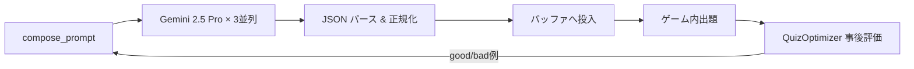
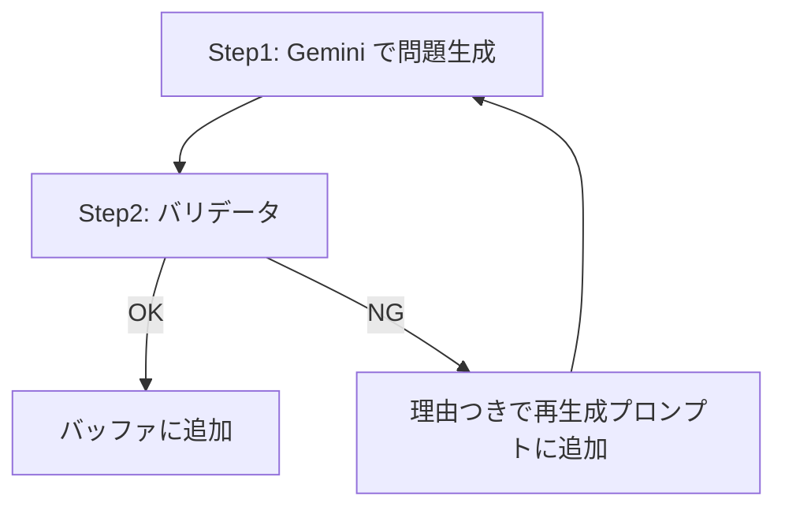

# オンラインモード クイズ品質向上アイデア集

## 現状分析

### 現在のアーキテクチャ


### 現在のプロンプトの強み
- 学年×教科ごとの**詳細なカリキュラムデータ**をハードコード
- 難易度3段階の**具体的な指示**
- **bad_examples** による禁止パターン指定
- `QuizOptimizer` による事後評価フィードバックループ

### 現在の弱点・改善余地
1. **プロンプトが巨大**（ ~1500トークン）で、LLMの注意が分散しやすい
2. **生成後のバリデーションが軽い**（正解インデックス範囲チェックのみ）
3. **正解の検証がない**（LLMが嘘の正解を出しても通過する）
4. **選択肢の質が不安定**（「明らかに違う」選択肢が混入しがち）
5. **教科間のバランス**が取れない（同じ単元に偏りやすい）
6. **事後評価のフィードバック量が少ない**（最大3例のみ注入）

---

## 💡 アイデア一覧

### 案1: Few-Shot例の動的強化（実装コスト：低）

> [!TIP]
> 最も手軽に効果が出やすい改善

**概要**: `quiz_ratings.json` の good/bad 例をもっと積極的にプロンプトに注入する

**現状**: `get_feedback_examples` で最大3例ずつしか注入していない

**改善案**:
- good例を **5〜8件** に増加（学年×教科×難易度でフィルタ）
- bad例には **「なぜダメか」の理由** を併記（現在の `reason` フィールドを活用）
- **JSON形式の完全な例** として注入する（現在はテキストのみ）
  ```
  ✕ 現在: 「半径4cmの円の直径は何cm？ (解答: 8cm)」
  ○ 改善: {"q":"半径4cmの円の直径は何cm？","c":["4cm","8cm","12cm","16cm"],"a":1,"e":"直径=半径×2"}
  ```
- Firebase から他ユーザーの **集計済み good 率の高い問題** を取得して例に追加

**期待効果**: LLMはFew-Shot例に強く従うため、出力フォーマットと問題品質の両方が安定する

---

### 案2: Generate → Validate → Retry の2段階パイプライン（実装コスト：中）

> [!IMPORTANT]
> 正解の事実確認を自動化する最もインパクトの大きい方法

**概要**: 生成された問題を別のLLMコール（またはルールベース）でバリデーションし、不合格なものを差し替える

**フロー**:


**バリデーション項目**:
| チェック項目 | 方法 |
|---|---|
| 正解が本当に正しいか | 別LLMに「この問題の正解はどれ？」と独立に解かせ、一致を確認 |
| 選択肢に重複がないか | 文字列比較（ルールベース） |
| 問題文の文字数 | `q.length() <= 50` のチェック |
| 選択肢の文字数 | 各 `c[i].length() <= 15` のチェック |
| 学年レベルの適正さ | 「この問題は何年生向きか？」と別LLMに判定させる |
| 難易度の適正さ | 「この問題の難易度は？」と別LLMに聞く |

**実装のポイント**:
- バリデータには **安価なモデル** (`gemini-2.5-flash`) を使い、コストを抑制
- 最大リトライ回数を2回に制限してレイテンシを許容範囲内に
- バリデーション不合格の理由を次の生成プロンプトに **ネガティブ例** として注入

---

### 案3: プレイヤー行動ベースの品質シグナル収集（実装コスト：中）

> [!NOTE]
> LLM評価に頼らない「リアルワールド」のフィードバック

**概要**: プレイヤーの回答パターンから問題品質を推定する

**収集する行動データ**:
| シグナル | 意味 | 品質推定 |
|---|---|---|
| 正答率が0%に近い | 問題が難しすぎる or 正解がおかしい | ⚠️ 要チェック |
| 正答率が100% | 簡単すぎる | ⚠️ 低品質の可能性 |
| 回答までの時間が極端に短い（<1秒） | 考えずに選んでいる＝自明な問題 | ⚠️ |
| 回答までの時間が適度（3-8秒） | ちょうどよい難易度 | ✅ 良問シグナル |
| 特定の誤答が集中 | 誤解を誘う良い誤答 or 正解が間違い | 🔍 要分析 |

**活用方法**:
- 正答率30-80%の問題を「良問」として自動マーク → Few-Shotに注入
- 正答率0%の問題を自動で「要バリデーション」キューに入れる
- Firebaseに集計結果を保存し、次回プロンプトの `bad_examples` に反映

---

### 案4: Structured Output / JSON Schema の厳密指定（実装コスト：低）

**概要**: Gemini API の `responseSchema` パラメータを使い、出力形式を厳密に制約する

**現在**: `"responseMimeType": "application/json"` のみ指定
**改善**: `responseSchema` を追加して、フィールド・型・文字数制約をAPIレベルで強制

```json
{
  "responseMimeType": "application/json",
  "responseSchema": {
    "type": "array",
    "items": {
      "type": "object",
      "required": ["q", "c", "a", "e"],
      "properties": {
        "q": { "type": "string", "description": "問題文 (50文字以内)" },
        "c": {
          "type": "array",
          "items": { "type": "string" },
          "minItems": 2,
          "maxItems": 4
        },
        "a": { "type": "integer", "minimum": 0, "maximum": 3 },
        "e": { "type": "string", "description": "解説 (20文字以内)" }
      }
    }
  }
}
```

**期待効果**:
- JSONパースエラーの完全排除
- 不正な `a` 値（範囲外）の排除
- 選択肢数の保証

---

### 案5: 動的な温度・多様性パラメータの調整（実装コスト：低）

**概要**: 難易度や状況に応じて `temperature` とシステムインストラクションを動的に変える

| 状況 | temperature | 理由 |
|---|---|---|
| 簡単モード | 0.3 | 基礎問題は正確性が最重要 |
| 普通モード | 0.5 | バランス |
| 難しいモード | 0.7 | 応用問題は創造性が必要 |
| リトライ時 | +0.1 加算 | 前回と異なる問題を出すため |
| 同じセッション内 | +0.05 ずつ加算 | マンネリ防止 |

**併せて**:
- `topK` や `topP` も難易度に応じて調整
- `systemInstruction` フィールドを活用して、ロール設定をプロンプト本文から分離（トークン節約＋注意集中）

---

### 案6: 教科書準拠データベースの活用（実装コスト：高）

> [!WARNING]
> 実装コストは高いが、品質のゲームチェンジャーになりうる

**概要**: 文部科学省の学習指導要領や教科書出版社の単元一覧を構造化データとして持ち、プロンプトに注入する

**データ構造**:
```
subject/算数/grade_4/
  ├── units.json          # 単元リスト＋学習目標
  ├── key_concepts.json    # 重要概念・公式
  ├── typical_mistakes.json # ありがちな間違い
  └── sample_questions.json # 教科書レベルの例題
```

**プロンプトへの注入フロー**:
1. ランダムに2-3単元を抽出
2. その単元の `key_concepts` と `typical_mistakes` を注入
3. 「この単元から出題せよ」と指示

**期待効果**:
- 単元の偏りが完全に解消
- 「ありがちな間違い」→ 魅力的な誤答の生成
- 教科書レベルの保証

---

## 📊 比較まとめ

| # | アイデア | 実装コスト | API追加コスト | 期待効果 | レイテンシ影響 |
|---|---|---|---|---|---|
| 1 | Few-Shot強化 | 🟢 低 | なし | ★★★☆ | なし |
| 2 | 2段階パイプライン | 🟡 中 | +1 Flash呼出し/バッチ | ★★★★★ | +2-3秒 |
| 3 | プレイヤー行動分析 | 🟡 中 | なし | ★★★☆ | なし |
| 4 | Structured Output | 🟢 低 | なし | ★★☆ | なし |
| 5 | 動的温度調整 | 🟢 低 | なし | ★★☆ | なし |
| 6 | 教科書DB構築 | 🔴 高 | なし | ★★★★★ | なし |

## 🎯 推奨する実施順序

1. **案4 (Structured Output)** + **案5 (動的温度)** → すぐ実装可能、リスクなし
2. **案1 (Few-Shot強化)** → 既存の `quiz_optimizer` をちょっと拡張するだけ
3. **案2 (2段階パイプライン)** → 最もインパクトが大きい。Flash で安くバリデーション
4. **案3 (プレイヤー行動分析)** → 案2と並行で、より長期的なデータ蓄積
5. **案6 (教科書DB)** → 時間をかけて段階的に構築

---

> 興味のある案があれば教えてください。詳細設計・実装に進みます！
